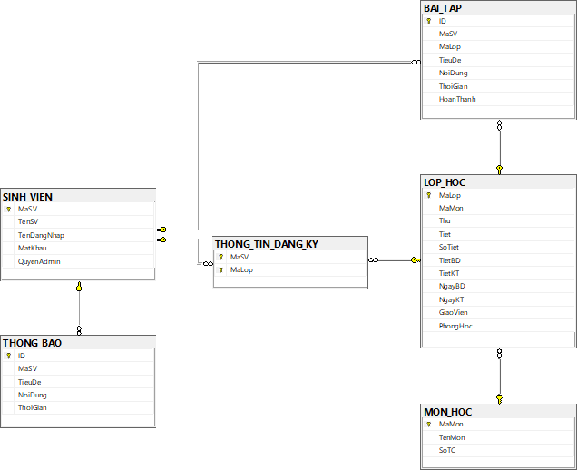
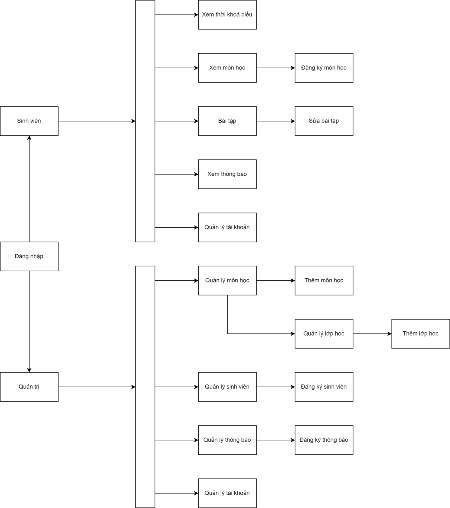
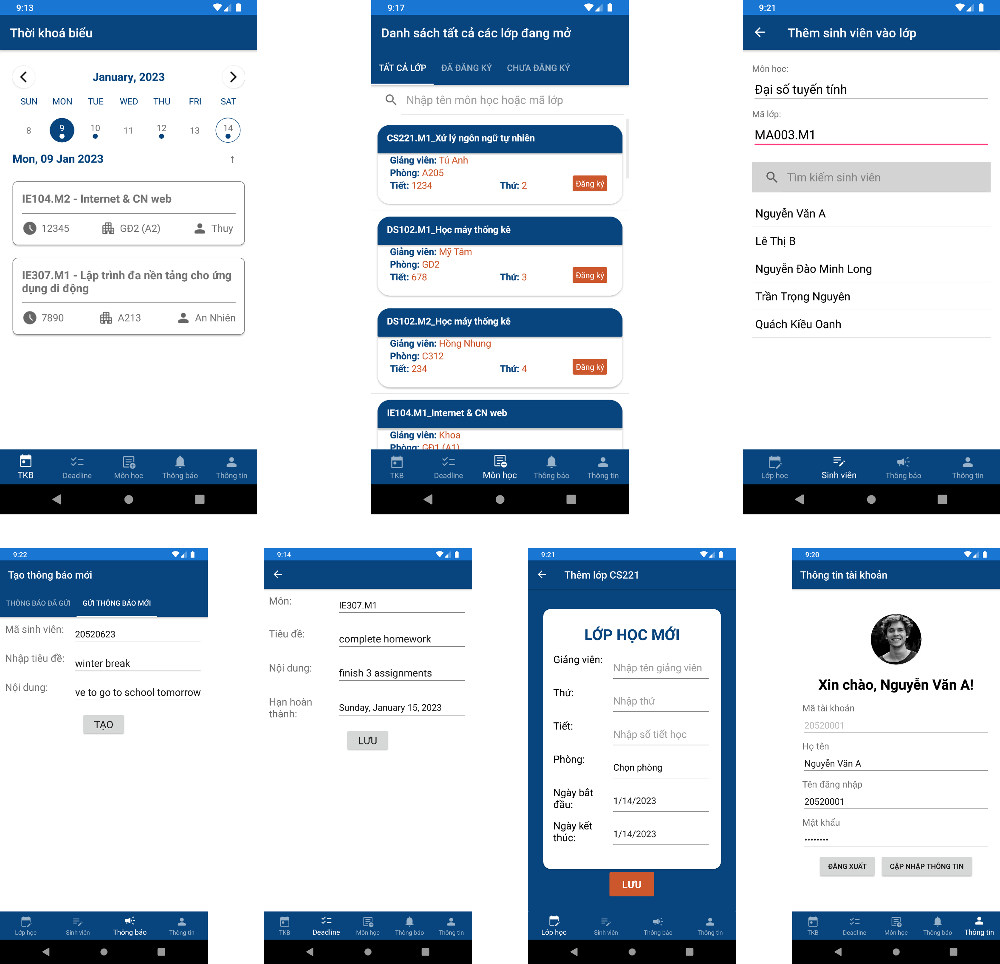

# Timetable App

- [Timetable App](#timetable-app)
  - [Giới thiệu tổng quan](#giới-thiệu-tổng-quan)
  - [Yêu cầu chức năng](#yêu-cầu-chức-năng)
  - [Thiết kế dữ liệu](#thiết-kế-dữ-liệu)
  - [Giao diện màn hình](#giao-diện-màn-hình)
  - [Mã nguồn](#mã-nguồn)
  - [Tác giả](#tác-giả)

## Giới thiệu tổng quan

Hiện nay, có nhiều sinh viên đang gặp khó khăn trong việc quản lý thời gian học tập của mình. Chính vì thế nên việc lập ra kế hoạch để quản lý thời khoá biểu và các công việc cần làm của mình là việc mà mỗi sinh viên nên làm.

Ứng dụng quản lý thời khoá biểu sinh viên sử dụng công nghệ đa nền tảng [Xamarin](https://dotnet.microsoft.com/en-us/apps/xamarin) có thể truy xuất dữ liệu từ SQL Server thông qua [ASP.NET Web APIs](https://dotnet.microsoft.com/en-us/apps/aspnet/apis), giúp sinh viên quản lý lịch học, thời khoá biểu cũng như các công việc học tập của mình.

> Đây là đồ án báo cáo cho môn học _Công nghệ lập trình đa nền tảng cho ứng dụng di động_ của nhóm sinh viên trường Đại học Công nghệ Thông tin - ĐHQG TP.HCM.

## Yêu cầu chức năng

| STT | Chức năng          | Mô tả                                                                                                                                                                                     | Ràng buộc                                                                                                                                                                   |
| --- | ------------------ | ----------------------------------------------------------------------------------------------------------------------------------------------------------------------------------------- | --------------------------------------------------------------------------------------------------------------------------------------------------------------------------- |
| 1   | Quản lý tài khoản  | Người dùng lần đầu truy cập ứng dụng có thể đăng nhập bằng tài khoản đã được cấp. Người dùng cũng có thể sửa đổi một số thông tin cá nhân của mình (như họ tên, tên tài khoản, mật khẩu…) | Có hai loại tài khoản là sinh viên và quản trị. Mỗi loại tài khoản sẽ có một loại chức năng khác nhau.                                                                      |
| 2   | Xem thời khoá biểu | Sinh viên có thể xem thời khoá biểu của một ngày bất kỳ. Trang giao diện sẽ có một thành phần giúp sinh viên chọn nhanh ngày theo tuần.                                                   |                                                                                                                                                                             |
| 3   | Đăng ký môn học    | Sinh viên có quyền tự đăng ký các môn học mà mình muốn. Quản trị viên cũng có thể tự thêm cũng như xoá sinh viên ra khỏi lớp.                                                             | Chỉ cho phép đăng ký các lớp mà quản trị viên đã mở. Sinh viên không được phép đăng ký các lớp đã kết thúc, các lớp bị trùng lịch học hiện tại và trùng với môn đã đăng ký. |
| 4   | Quản lý lớp học    | Quản trị viên có quyền mở và sửa đổi thông tin các lớp từ danh sách các môn quản lý.                                                                                                      |                                                                                                                                                                             |
| 5   | Quản lý thông báo  | Quản trị viên có thể gửi đi thông báo đến sinh viên cụ thể hoặc tất cả cá sinh viên.                                                                                                      |                                                                                                                                                                             |
| 6   | Quản lý bài tập    | Mỗi sinh viên có thể tự tạo các công việc/bài tập cần làm cho các lớp đã đăng ký, và đánh dấu lại sau khi hoàn thành.                                                                     |                                                                                                                                                                             |

## Thiết kế dữ liệu

## Giao diện màn hình

## Mã nguồn

- Mã nguồn ứng dụng: <https://github.com/minhlong149/timetable-app>
- Mã nguồn Web API: <https://github.com/minhlong149/timetable-api>
- Live API: <http://lno-ie307.somee.com/>

## Tác giả

- [Nguyễn Đào Minh Long](https://github.com/minhlong149)
- [Trần Trọng Nguyên](https://github.com/Norman-Tran)
- [Quách Kiều Oanh](https://github.com/Qanh195)
